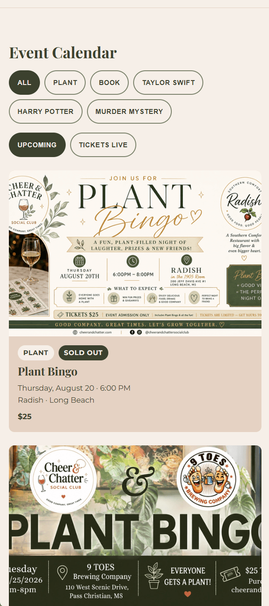
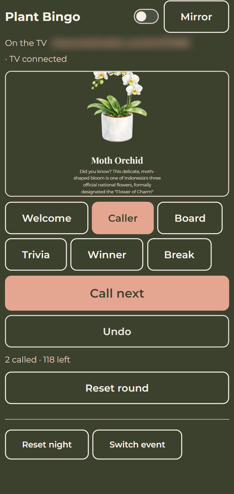
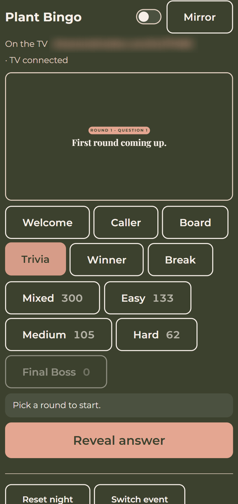
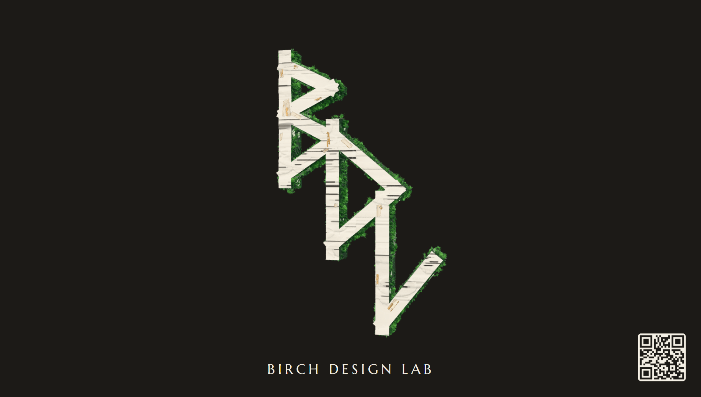
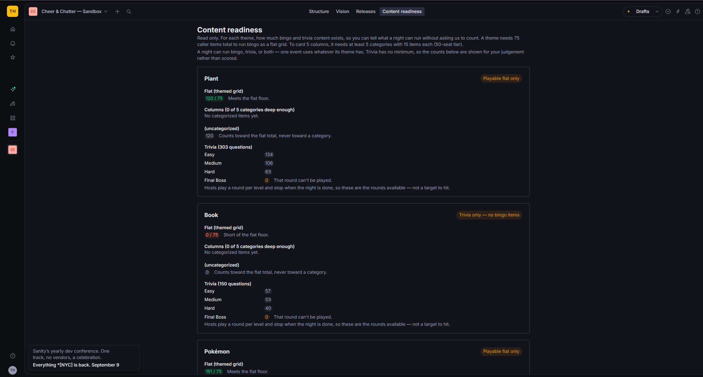

Cheer and Chatter Social Club runs themed game nights across the
Mississippi Gulf Coast. Plant Bingo, Blind Date with a Book, Harry Potter
Bingo, murder mysteries, private bookings. A couple with three young kids
building the kind of gathering place they wished existed, where people put
their phones down and meet each other.

They came to us as the business was being stood up, needing two things: a
site that sells tickets, and a way to actually run game night. Six weeks
later both were real, and had been proven in front of paying rooms: the
site went live on day thirteen and the first two ticketed nights sold out.

## The site

A marketing and ticketing site where the owners control every word without
touching code. Events, venues, page copy, and game content all live in
Sanity; the site rebuilds itself on every publish and again each morning,
so yesterday's event retires itself without anyone remembering to do it.

Ticketing is content too. The owners drop a ticket link into a field,
the site checks it against a short list of platforms it trusts, and builds
the checkout page itself, on the club's own domain. When the last ticket
sells, the box office tells the site directly. The page flips to sold out
by itself, and flips back if a ticket is refunded. On event day, nobody
touches anything.

The same discipline runs through the whole model: there is a field for
everything and everything lives in its field. The event page, the calendar
cards, the search listing Google assembles, and the waitlist email that
names the right night are all composed from the same structured facts,
entered once.

Every vendor account belongs to the owners. Domain, hosting, content
studio, email, ticketing. If we vanished tomorrow, they lose nothing.

> House rule: the client owns their own shop. We hold keys, not deeds.

## The live event application

The interesting half. Game night needs a caller, a board, and a room that
can see both. So the site grew an auth-gated live area: the host runs the
night from a phone, and the venue TV shows the crowd screen. The two pair
by a five-character code, connect from any network, and stay in sync
through a small realtime worker that costs nothing while idle.

Pairing by typed code rather than a cast button is not a shortcut, it is the
only door iOS leaves open. An iPhone can mirror itself to a television, but
mirroring throws the *whole device* at the room, host console and all, which
is precisely the setup the two-device design exists to replace. Handing a
page to the TV's own browser is not something iOS will do, and every
alternative costs the client hardware. So the code got designed properly
rather than apologized for: five characters from an alphabet with no
lookalikes in it, remembered by both devices, typed once at the first venue.

Bingo came first and ran a real room on August 8. Then trivia grew from a
footnote into a round system: a tap starts the next round at a chosen
difficulty, no question ever repeats across a night, the TV holds a round
splash while the host works the room, and every tier button carries a live
count of what's left. The best code is the code a sharp data model makes
unnecessary.

The content pipeline behind it: nine hundred forty-two trivia questions and
four hundred fifty-one pieces of caller art across four full photo decks,
parsed out of the owners' own documents and catalog PDFs by import scripts
that write to the practice dataset unless told otherwise in as many words.
Before an event, the night's art caches onto the device, so a venue with
bad wifi cannot take the show down. If the phone dies mid-round, the whole
night resumes where it stood: board, winners, round, and which questions
have been asked.

> We rehearsed the whole thing in a living room with a phone and a smart TV
> before the first real night. Rehearsal catches what tests cannot, including
> a TV keyboard that capitalizes room codes. The round system gets the same
> treatment with the owners before its debut, because shipped and tested is
> not the same as played.

## The break screen

Everything in the app holds still on purpose; the content is the show. The
one exception is the break screen: an auto-advancing loop that thanks
tonight's venue, shows the club, and gives sponsors a card. Its centerpiece
is ours: a continuously rotating 3D model on the Birch Design Lab card,
compressed from a 12MB export to 3MB, judged by eye against the original
before it shipped, with a committed still of the model standing behind it
as the no-JavaScript insurance. The rule that the whole screen obeys was
written down before the first frame moved: nothing the room sees may depend
on code that might not arrive.

## The controls they keep

The owners run everything through Sanity Studio, including a readiness
gauge that counts their content pools per theme, per difficulty, so they
know a night is playable before they announce it. The gauge is honest
enough to say "enough for a smaller card" instead of failing a 60-item
deck that was built for a 3x3 night. The event picker only lists nights
that can actually run.
Validation talks like a person: a duplicated event still carrying its
original's web address gets a sentence telling the owner exactly which
button fixes it, because the failure it prevents is two events sharing one
page and one mailing list.

## The shape of the work

Six weeks from first commit to delivered v1. Nineteen thousand nine
hundred forty-seven lines of code in five hundred eighty shipped changes
across one hundred seventy-three pull requests, five hundred twenty-three
automated tests green at handover, and two owner manuals
written against the finished system so the site and the live app can be run
without calling us. The site launched on day thirteen, sold out its first
two ticketed nights, and the live application has run a real room with two
more on the calendar.

> Everything on this page is the same kind of work the Lab practices in
> the open. The experiments are how we sharpen it; this is where it cuts.
